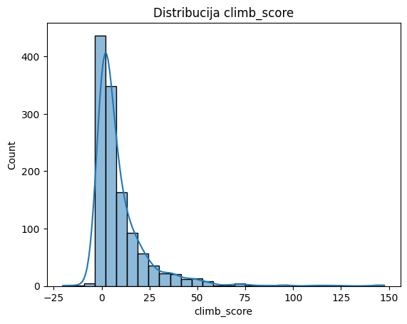
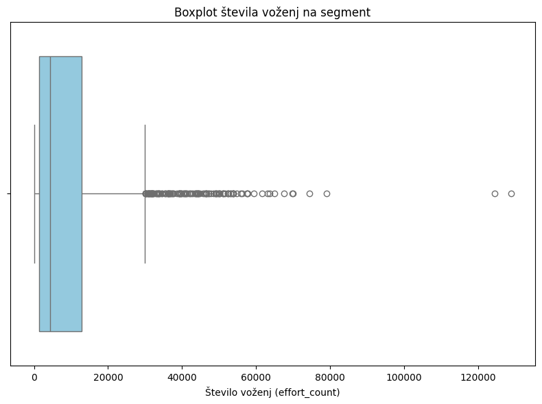
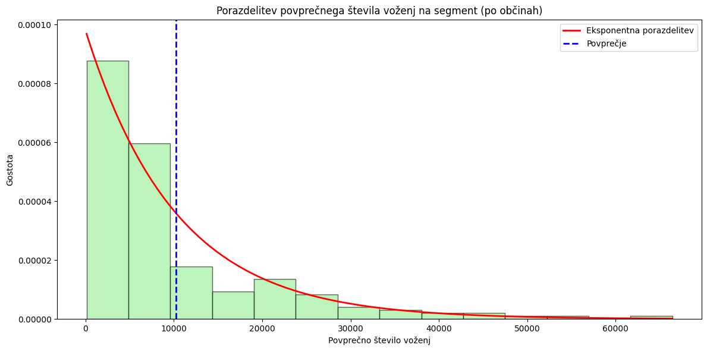
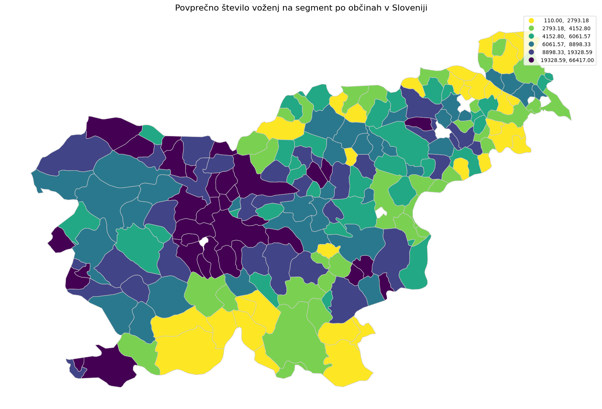
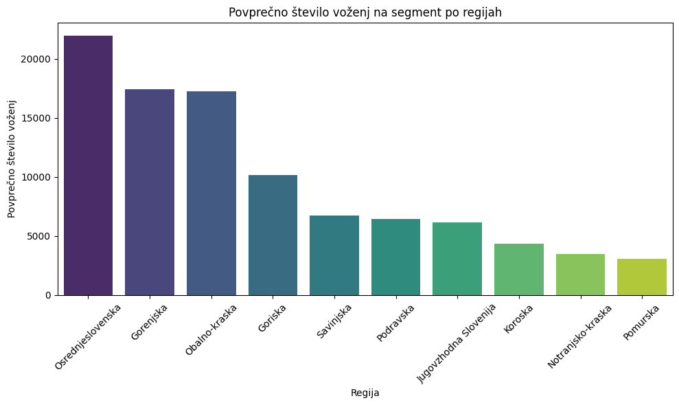
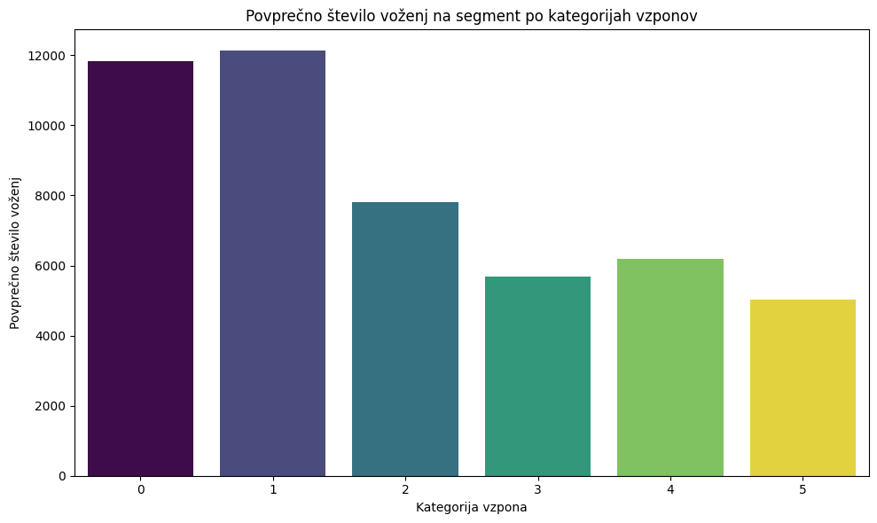
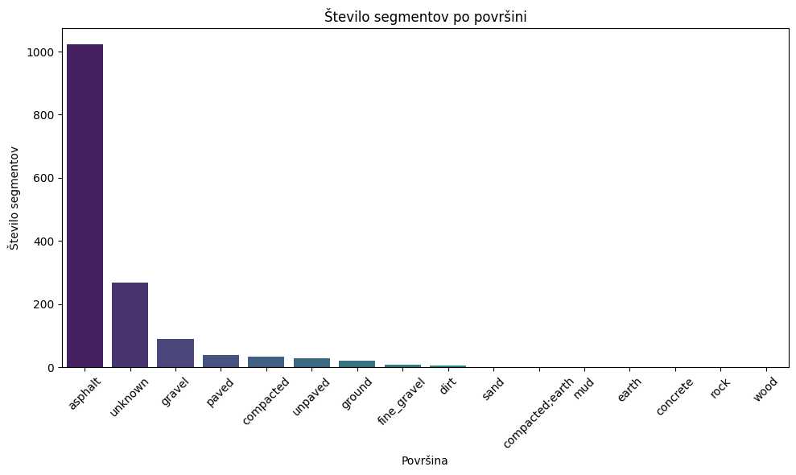
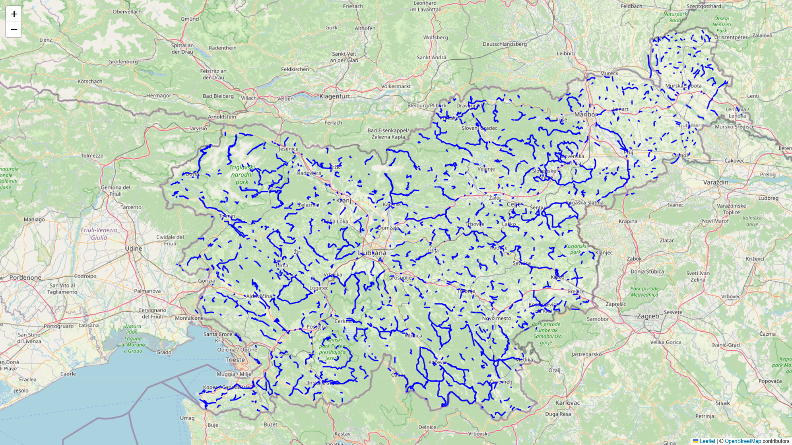
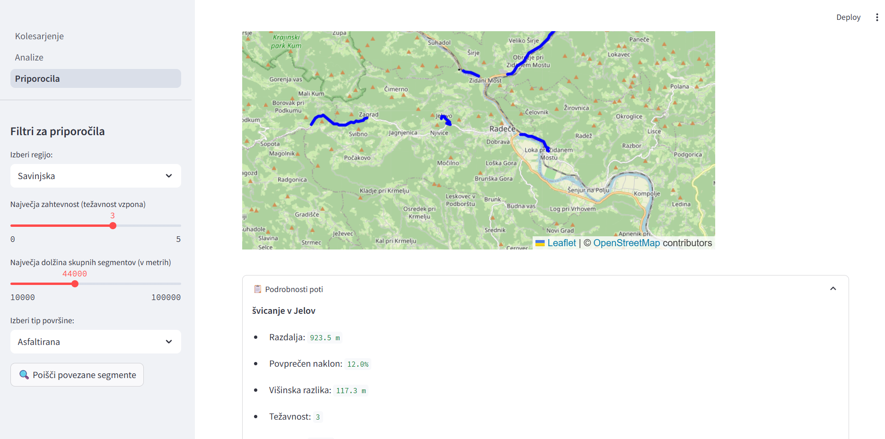

## Kje danes kolesarim? 
#### Geografska analiza rekreativnega kolesarjenja v Sloveniji

---

**Problem**

Cilj projekta je analiza rekreativnega kolesarjenja v Sloveniji z uporabo podatkov iz aplikacije Strava. Glavni problem je pridobiti, očistiti in analizirati podatke o kolesarskih segmentih, ki so relevantni za območje Slovenije, ter iz njih izluščiti zanimive ugotovitve glede geografskega razporeda, dolžine, težavnosti in priljubljenosti segmentov.

---

**Podatki**

Podatke pridobivamo prek Strava API, ki omogoča dostop do informacij o kolesarskih segmentih. Segmenti so v kontekstu Strave posebej označeni deli poti, na katerih se avtomatsko beleži čas uporabnika aplikacije, ko in če ga ta prevozi v celoti. Segmente lahko ustvarjajo uporabniki sami, večina je javno vidnih. Ker je teh veliko, jih kolesarji vede ali nevede prevozijo na svojih "turah" in s tem beležijo nekakšno "priljubljenost" oz. effort_count segmenta.

Uporabljali smo dva API requesta: `get_segments`, ki vrača top10 segmentov na pravokotnem območju označenem s skrajno jugozahodno in severovzhodno koordinato, in `segment_id`, ki na podlagi id segmenta vrača dodatne podatke.
Za zajem podatkov smo razdelili območje Slovenije na mrežo pravokotnikov dveh velikosti, da zajamemo vse segmente, ki so popolnoma znotraj posameznih območij. Ta pristop omogoča zajem segmentov, tudi če prečkajo meje posameznih mrežnih celic. Skupno je bilo generiranih 495 manjših in 32 večjih celic za pridobivanje podatkov.

Pridobljeni surovi podatki so bili združeni in očiščeni, odstranjeni so bili podvojeni segmenti. Nato smo s pomočjo `geojson` datoteke slovenske meje izločili segmente, ki se nahajajo popolnoma zunaj Slovenije. Po čiščenju je ostalo 1526 unikatnih segmentov znotraj Slovenije.

Segmentom smo v nadaljni fazi projekta dodali še dva atributa: `regija`, ki v tem primeru predstavlja širšo; t.i. statistično regijo in `surface`, ki pove kakšna je cestna podlaga na poteku segmenta. Podlago smo določili s pomočjo dekodiranja polyline stringa ki ga ima vsak segment v seznam koordinat. Tem smo s pomočjo OpenStreetMap določili podlago.

Segmentom smo zbrisali za nadaljno analizo nepotrebne atribute in izračunali dodatne, po lastni presoji. Glavni poudarek na spreminjanju kategorije vzponov, z namenom pridobiti lestvico relevantno za področje Slovenije in pa določanju regije oz. občine, kateri segment pripada (ključno za nadaljno prostorsko analizo). Končni "čisti" podatki vsebujejo atribute:
```['id', 'name', 'activity_type', 'distance', 'average_grade', 'maximum_grade', 'elevation_high', 'elevation_low', 'start_latlng', 'end_latlng', 'elevation_profile', 'elevation_profiles', 'country', 'total_elevation_gain', 'map', 'effort_count', 'kom', 'qom', 'climb_score', 'is_flat', 'custom_climb_category', 'region', 'regija', 'surface']```

Formula za izračun `climb_score`:
$$
\text{climb\_score} = \frac{\text{avg\_grade} \times \text{total\_elevation\_gain}}{100}
$$

Glede na porazdelitev `climb_score` izbrane mejne vredosti za kategorije:
```bins = [-float("inf"), 4, 10, 20, 40, float("inf")]```



---

**Izvedene analize**

1. Osnovne ugotovitve:
- 1526 segmentov.
- 14874530 zabeleženih voženj na teh segmentih.
- 9747 voženj povprečno na segment.
- Večina segmentov v okolici povprečja, veliko segmentov z visoko nadpovprečnim številom voženj, maximalno "Ruda sprint" s 128925 vožnjami.



2. Povezava regij oz. občin in števila voženj:
- Zaradi metode pridobivanja podatkov so ti približno enakomerno razpršeni, upoštevajoč velikost posamezne občine.
- Najbol prevožene so pričakovane občine npr. Ljubljana, Koper, Bovec, Kranjska Gora.

| Rank | Municipality     | Total Effort Count |
|------|------------------|--------------------|
| 1    | Ljubljana        | 1,033,332          |
| 2    | Koper            | 738,828            |
| 3    | Bovec            | 512,133            |
| 4    | Kranjska Gora    | 451,758            |

- Porazdelitev povprečnega števila voženj na segment (po občinah) približno eksponentno pada.



- Vizualizacija povprečnega števila voženj po posameznih slovenskih občinah nazorno prikazuje neenakomerno prostorsko porazdelitev, območje okoli glavnega mesta Ljubljane, obala, primorska ob meji z Italijo, turistično močnejši deli gorenjske in okolice mestnih občin beležijo več rekreativnega kolesarjenja, medtem ko je to v južnem, jugovzhodnem delu, na koroškem, prekmurju, ... slabše zastopano.



- Porazdelitev je sicer dokaj vzporedna porazdelitvi slovenskega prebivalstva a vseeno prikazuje območja, kjer bi bilo dobro rekreativno kolesarstvo na različne načine vzpodbujati.

- Dodatna vizualizacija: stolpični diagram povprečnega števila voženj v 10 statističnih regijah


3. Povezava med številom voženj in kategorijo vzpona
- Pričakovano so najbolj prevoženi ravninski segmenti in segmenti 1. kategorije (najlažji, najbolj dostopni, povezovalni).
- Pri višjih kategorijah je opazen rahel padajoč trend, vendar tudi visokokategorizirani oz. težki segmenti premorejo veliko voženj, kar lahko namiguje na naravo rekreativnih kolesarjev, ki niso le "turistični športniki" vendar se radi preizkusijo tudi na težjih izzivih.



4. Cestna površina:

- Velika večina pridobljenih segmentov je cestnih (surface: asphalt, paved, concrete), v manjšini so makadamske poti. Tudi povprečno število voženj je visoko prevladujoče v asfaltiranih segmentih. Izjema je en sam segment z oznako površine 'earth', ki izstopa po številu voženj.


---

**Glavne ugotovitve**

- Segmenti so razporejeni po celotni Sloveniji, kar kaže na raznolikost in dostopnost kolesarskih poti.
- Segmenti so v aplikaciji ocenjeni glede na priljubljenost (število zvezdic uporabnikov), kar omogoča identifikacijo najbolj zanimivih in pogosto voženih poti. To upliva tudi na nabor top 10 segmentov, ki jih dobimo prek API request na določenem področju.
- Kljub enakomerni razporejenosti, segmenti niso enakomerno prevoženi kar nakazuje na različno kolesarsko aktivne regije.
- Najbolj priljubljeni so ravni oz. lahki segmenti, priljubljenost s težavnostjo pada.



---

**Integracija slik s Komoota**

- Poskusili smo povezati Stravine segmente s slikami s Komoot routes, ki se nahajajo na isti lokaciji, a je bil prvi problem že sama pridobitev podatkov s Komoota, saj ta nima javnega API-ja. Tako smo poskusili s Seleniumom, a je delalo prepočasi, nato pa smo med raziskovanjem klicev na Komootovi spletni strani odkrili klice na zasebni API, kar smo uporabili za pridobitev podatkov o poteh (routes). Ko smo potem poskusili podobno še s slikami, je za vsako pot prikazalo le eno sliko. Tega nam na žalost ni uspelo rešiti in tako nismo mogli uporabiti Komootovih slik.

**Streamlit aplikacija**

- V sklopu projekta smo pripravili Streamlit aplikacijo Kolesarjenje ki ima tri glavne strani:
    - Osnovna stran z interaktivnim zemljevidom segmentov,
    - stran z analizami podatkov in vizualizacijami,
    - "sistem" za priporočanje segmentov in poti glede na uporabnikove želje.

- Odločili smo se, da bomo naredili priporočilno aplikacijo, kjer uporabnik vnese nekaj parametrov in glede na njih aplikacija prikaže ustrezno pot. Parametri so: regija, skupna dolžina segmentov, težavnost in podlaga. Aplikacija na podlagi atributov izbere segmente in jih interaktivno predstavi uporabniku. Ta ima nato možnost planiranja poti, ki te segmente vključuje. (Segmenti so poleg atributov filtrirani tudi tako da se konec enega ne nahaja dlje kot 10 km stran od naslednjega, zato je korak planiranja poti lažji.)

**Nadaljne možnosti**

Če bi se projekt nadaljeval bi v funkcionalnost aplikacije lahko dodali planiranje poti, skratka povezovanje začetnih in končnih točk priporočenih segmentov v neko smiselno traso.

